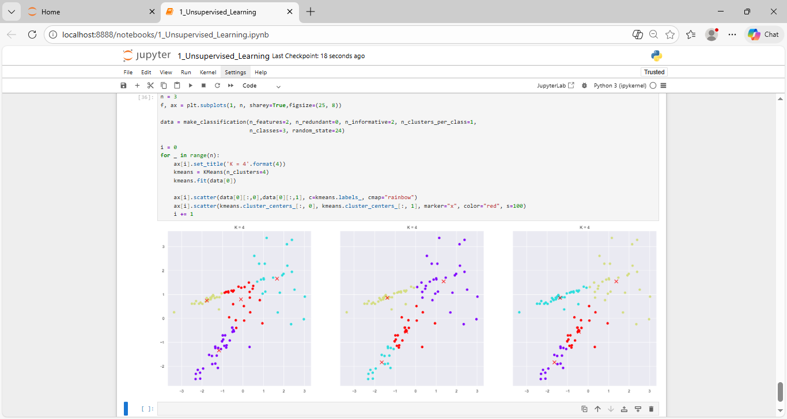
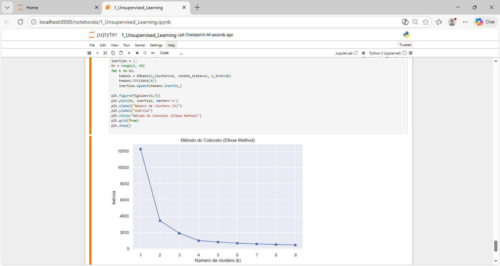
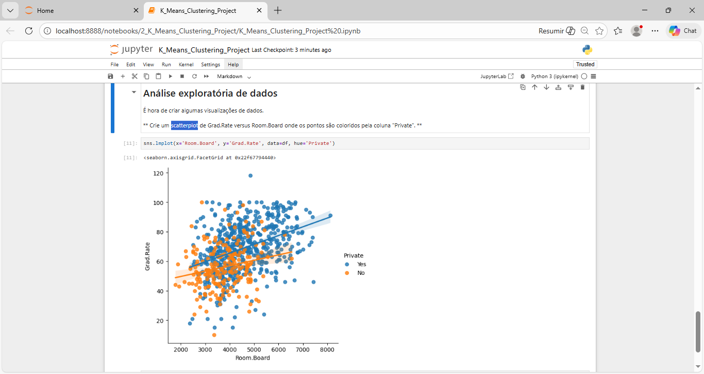
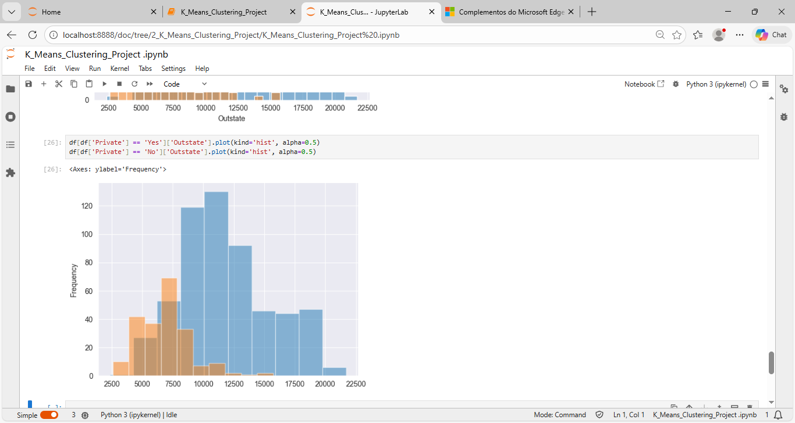
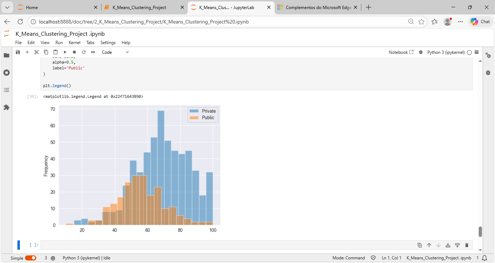
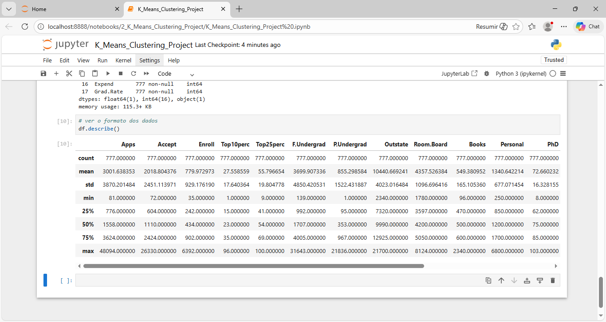

# Unsupervised_Models
The Unsupervised Models course is an essential journey for anyone seeking to understand and apply advanced Data Science and Machine Learning techniques in their daily professional life.

# 📊 Unsupervised Learning Models

## 🧠 About the Course
The **Unsupervised Learning Models** course is an important step for people who want to understand and use **Data Science** and **Machine Learning** techniques in real situations.

Unsupervised learning is very important in the industry because models can **find patterns and groups in data without labels**. This means people do not need to classify the data before, which saves time and cost.

These techniques are used in many real applications, such as:
- Fraud detection
- Customer segmentation
- Anomaly detection
- Process optimization

The course combines **theory** and **practical exercises**, helping students apply the concepts with confidence.

---

## 🎯 What You Will Learn
- Introduction to **unsupervised learning**
- **KMeans**: basic concept, practice, and problems
- **Elbow Method**
- **Mixture Models**
- **Gaussian Mixture Models (GMM)**
- **Anomaly detection**
- Practical project: clustering and segmentation of American universities

---

## 📚 Course Content

### 📌 Module 1 — Unsupervised Learning Models
- Course introduction and basic concepts
- KMeans in practice
- How the KMeans algorithm works
- Problems and limitations of KMeans
- Elbow Method
- Mixture Models
- Mathematical definition of Mixture Models
- Gaussian Mixture Models
- GMM in practice
- Anomaly detection with GMM

---

### 📌 Module 2 — Clustering and Segmentation of American Universities
- Project: university classification
- Exploratory data analysis
- Training a KMeans model
- Cluster interpretation

---

## 👥 Who This Course Is For
- Students of **Machine Learning** who want to learn more about clustering
- Data analysts who want to **find patterns without labeled data**
- Data science professionals looking for **advanced techniques**
- People interested in practical unsupervised learning projects

---

## 📌 Prerequisites
- Knowledge of **Classification and Regression Models**
- Basic knowledge of **Python for Data Science**

---

## 🧩 Knowledge Area
**Data Science & Machine Learning**

---

## 🚀 Learning Outcomes
After this course, the student will be able to:
- Understand the difference between **KMeans** and **GMM**
- Interpret clusters and probability distributions

--------

### Img projects

## Screenshots

Here are some images showing the layout of the application:

________________________________________

<h4 align="center">Unsupervised_Models  🥰 🚀</h4>

    <table>
        <tr>
            <td style="width: 50%; text-align: center;">
                
                
linha, colunas e cores_Unsupervised_Learning

            </td>
            <td style="width: 50%; text-align: center;">
                
                
gráfico com clusters, centróides, legenda, anotações_Unsupervised_Learning

            </td>
        </tr>
    </table>

   
   

________________________________________

    <table>
        <tr>
             <td style="width: 50%; text-align: center;">
                
                
1_Unsupervised_Models_Img/4_criar 2 subplotes

            </td>
            <td style="width: 50%; text-align: center;">
                
                
9_Unsupervised_cluster_centers

            </td>
        </tr>
    </table>

   
   

  ________________________________________

  
<h4 align="center">Unsupervised_Models 🥰 🚀</h4>

    <table>
        <tr>
            <td style="width: 50%; text-align: center;">
                
                
1_Unsupervised_Models_Img/11_inertias_Unsupervised

            </td>
            <td style="width: 50%; text-align: center;">
                
                
1_Unsupervised_Models_Img/16_Gaussian Mixture Model

            </td>
        </tr>
    </table>

   
   

________________________________________

    <table>
        <tr>
             <td style="width: 50%; text-align: center;">
                
                
2_K_Means_Clustering_Project_Img/10_vetores centrais do cluster_K_Means_Clus

            </td>
            <td style="width: 50%; text-align: center;">
                
                
Regressão Linear Dados x. Reta Ajustada_grafic

            </td>
        </tr>
    </table>

   
   

  ________________________________________

<h4 align="center">Unsupervised_Models 🥰 🚀</h4>

    <table>
        <tr>
            <td style="width: 50%; text-align: center;">
                
                
2_K_Means_Clustering_Project_Img/5_FacetGrid_K_Means

            </td>
            <td style="width: 50%; text-align: center;">
                
                
2_K_Means_Clustering_Project_Img/9_K_Means_Clus_see_grafic

            </td>
        </tr>
    </table>

   
   

________________________________________

    <table>
        <tr>
             <td style="width: 50%; text-align: center;">
                
                
2_K_Means_Clustering_Project_Img/7_K_Means_Clus._taxa de graduação superior a 100

            </td>
            <td style="width: 50%; text-align: center;">
                
                
2_K_Means_Clustering_Project_Img/2_format_Date_Table_K_Means_Clustering_Project

            </td>
        </tr>
    </table>

   
   

  ----

#### Portugues

# 📊 Modelos Não Supervisionados

## 🧠 Sobre o curso
O curso **Modelos Não Supervisionados** é uma jornada essencial para quem deseja compreender e aplicar técnicas avançadas de **Ciência de Dados** e **Machine Learning** no dia a dia profissional.

O aprendizado não supervisionado é uma área de grande interesse e investimento na indústria, pois permite que modelos descubram **padrões e relações ocultas nos dados sem rótulos prévios**, eliminando a necessidade de classificação manual — um processo custoso e demorado.

Dominar essas técnicas abre portas para aplicações reais como:
- Detecção de fraudes
- Segmentação de público
- Detecção de anomalias
- Otimização de processos industriais

O curso combina **fundamentação teórica sólida** com **exercícios práticos**, permitindo aplicar os conceitos com confiança em problemas do mundo real.

---

## 🎯 O que você vai aprender
- Introdução ao **aprendizado não supervisionado**
- **KMeans**: conceito, funcionamento, prática e limitações
- **Elbow Method** (método do cotovelo)
- **Mixture Models**
- **Gaussian Mixture Models (GMM)**
- Detecção de **anomalias e fraudes**
- Projeto prático de **clusterização e segmentação de universidades americanas**

---

## 📚 Conteúdo do curso

### 📌 Módulo 1 — Modelos de Aprendizado Não Supervisionado
- Apresentação do curso e conceitos fundamentais
- KMeans na prática
- Funcionamento do algoritmo KMeans
- Problemas e limitações do KMeans
- Elbow Method
- Mixture Models
- Definição matemática dos Mixture Models
- Gaussian Mixture Models (GMM)
- GMM na prática
- Detecção de anomalias com GMM

---

### 📌 Módulo 2 — Clusterização e Segmentação de Universidades Americanas
- Projeto: classificação de universidades
- Análise exploratória de dados
- Treinamento de modelo KMeans
- Interpretação dos clusters

---

## 👥 Para quem este curso é recomendado
- Estudantes de **Machine Learning** interessados em modelos de clusterização
- Analistas de dados que desejam **descobrir padrões sem rótulos**
- Profissionais de **Ciência de Dados** em busca de técnicas avançadas
- Pessoas interessadas em **aplicações práticas de aprendizado não supervisionado**

---

## 📌 Pré-requisitos
- Conhecimento prévio em **Modelos de Classificação e Regressão**
- Noções básicas de **Python para Ciência de Dados**

---

## 🧩 Área de conhecimento
**Data Science & Machine Learning**

---

## 🚀 Resultado do aprendizado
Ao final do curso, o aluno será capaz de:
- Escolher corretamente entre **KMeans** e **GMM**
- Interpretar clusters e distribuições probabilísticas
- Aplicar aprendizado não supervisionado em **dados reais**
- Desenvolver projetos práticos de clusterização e segmentação

-----
- Apply unsupervised learning to **real-world data**
- Build practical clustering and segmentation projects

----
----

Python: Linguagem principal utilizada para desenvolver o app.

________________________________________
### Python: The main programming language used to build the app.

#### 🤝 Contributing
If you would like to contribute to this project, feel free to open an issue or submit a pull request! 🚀
________________________________________
#### 📜 License
This project is licensed under the MIT License - see the LICENSE file for details.
👩💻 Developed with 💙 by [[LuDiemert](https://www.linkedin.com/in/lucianadiemert/)]

________________________________________
- #### My LinkedIn - 

________________________________________
## 🌐 **Contact**

#### [**Luciana Diemert**](https://github.com/ludiemert)

🛠 Full-Stack Developer  
🖥️ Python | Computer Vision | AI Integrations  
📍 T23 R2RV,  Cork - Irland 
☎ +353 87 243 8690

&nbsp;
&nbsp;
&nbsp;
&nbsp;

 

---
Developed with ❤ by [ludiemert](https://github.com/ludiemert).
